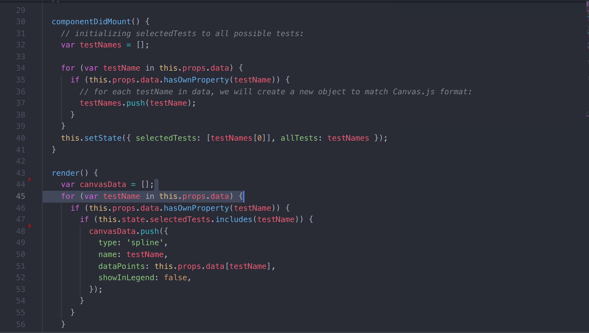
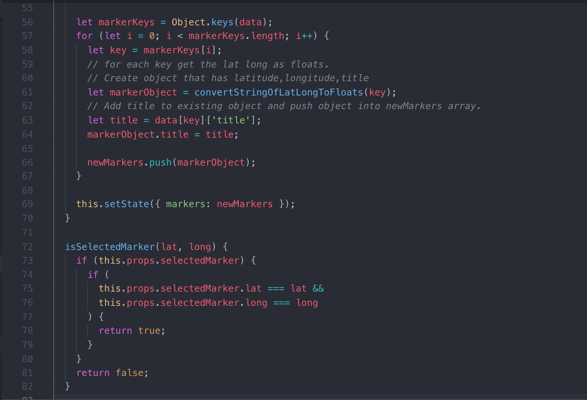

## Project title
The watershed guardians is a web application that serves the county of Monterey by helping local residents understand the impacts of climate change on the Carmel river watershed by using maps and graphs.

## Motivation
I was working at the watershed and saw the impact that the river has on the local population. The water,agriculture and tourism industry all depend on the river as a source of water but don't understand the impact that climate change can have on the water source and how it can affect their personal lives. I wanted to build this project to hopefully project a visual understanding of **why this matters**.

## Code style
 [Airbnb/JSX](https://github.com/airbnb/javascript/tree/master/react)
 
## Screenshots

## Tech/framework used
<b>Built with</b>
- [React](https://reactjs.org/)
- [Mapbox](https://www.mapbox.com/)
- [UberMapboxReactGL](https://github.com/uber/react-map-gl)

## Code Example
Show what the library does as concisely as possible, developers should be able to figure out **how** your project solves their problem by looking at the code example. Make sure the API you are showing off is obvious, and that your code is short and concise.

## Installation
run
**NPM INSTALL**
**NPM START**

## API Reference
* [MAPBOX](https://www.mapbox.com/)
* [CANVASJS](https://canvasjs.com/)
* [GOOGLE SPREADSHEETS API](https://developers.google.com/sheets/api/)

## How to use?
1. The info-panel on the screen gives information about what the project is about and why it's important. 
It also gives a description of the tests and how to understand what the results of the tests mean. This is a good starting point to understand what the website is about.

2. Clicking on a marker, a Graph will render. A user can hover over the graph to get what each point of data for that day it.
on the left, there is a description of what the ranges of values for the tests for a healthy river are and a user can compare it to the values that are on the graph.

3. Clicking on multiple checkboxes lets the user render multiple graphs for different tests. There is an info button next to each test to learn more about how each test effects the river and in what way.

## Contribute
Thank you for thinking about contributing! Please create a pull request and follow the standard guidlines for contributing to the project. [contribute](https://github.com/zulip/zulip-electron/blob/master/CONTRIBUTING.md)

## Write detailed information
Detailed information is very helpful to understand an issue.

* When you edit the code, please run `npm run test` to check the formatting of your code before you `git commit`.
* Ensure the PR description clearly describes the problem and solution. It should include:

## Credits
* [Asaya.io](http://www.asaya.io/) - For their committed help towards helping students acheive their true potential.
* [Pacific Grove Museum of Natural History](https://www.pgmuseum.org/)- For undertaking this project and doing work that really matters.
* [Calfifornia State University Monterey Bay](https://csumb.edu/)- For encouraging students and researchers to tackle issues at any level.
* [Elkhorn Slough](https://www.elkhornslough.org/) - For their inspirational graphs and website

## License

MIT © [GAUTAM TATA](http://www.gautamtata.com)
